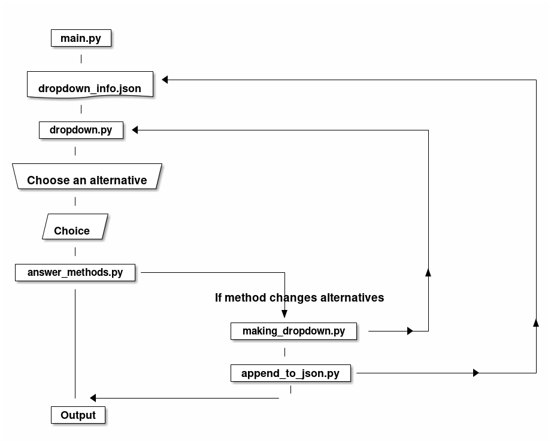

.. Services Monitoring documentation master file, created by
   sphinx-quickstart on Mon Apr  3 12:52:03 2023.
   You can adapt this file completely to your liking, but it should at least
   contain the root `toctree` directive.

Services Monitoring Documentation
==================================

.. toctree::
   :maxdepth: 2
   :caption: Contents:

Introduction
------------

This package was built to monitor and administer `Celery <https://docs.celeryq.dev/en/stable>`_ and `Systemd <https://www.freedesktop.org/wiki/Software/systemd/>`_ services that I had built. It soon turned obvious that this was a great tool to interact with all kinds of *systemd* services, and it was built to do that also.
It gives you the opportunity to interact with a service created by it, or, to interact with any other service. Its goal is to save you time and headspace, trying to remember all of *systemctl* commands.

Indices and tables
------------------

* :ref:`genindex`
* :ref:`search`

Contents
--------

.. toctree::
   answer_methods
   append_to_json
   dropdown
   main
   make_dropdown

External Dependencies
----------------------

* `Click <https://click.palletsprojects.com/en/8.1.x/>`_
* `Questionary <https://questionary.readthedocs.io/en/stable/index.html>`_

Application Structure
---------------------

